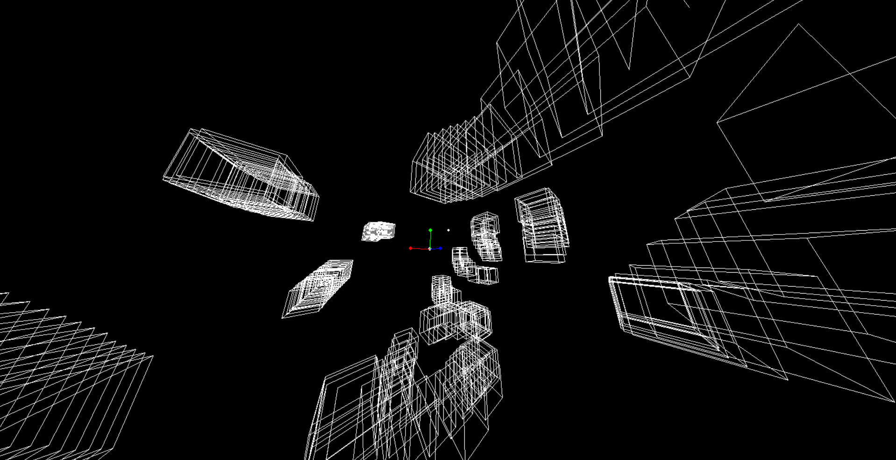

# DelRenderer

DelRenderer is a simple 3D renderer implemented in Python.



## Table of Contents
- [Introduction](#introduction)
- [Features](#features)
- [Installation](#installation)
- [Usage](#usage)
- [Contributing](#contributing)
- [License](#license)

## Introduction

DelRenderer is a 3D renderer designed to provide basic functionalities for 3D rendering. It is implemented in Python using standard libraries and pygame, making it easy to understand and extend.

## Features:
- Camera movement
- Debug menu (F1)

## Planned Features:
- Add color support
- UI for adding, editing and removing objects
- Add grid system
- Add preview for placing objects
- Editable Gravity

## Installation

1. Clone the repository:
    ```bash
    git clone https://github.com/D4N1L0200/DelRenderer.git
    ```
2. Navigate to the project directory:
    ```bash
    cd DelRenderer
    ```
3. Install dependencies:
    ```bash
    pip install -r requirements.txt
    ```
4. Run the terminal emulator:
    ```bash
    python src/main.py
    ```
   
## Usage

### NOTE:
The current version has the 3d mode hidden, you can only use the 2d mode. Middle mouse button to move, Left mouse to spawn a square, F1 for the debug menu and F2 to spawn 100 squares randomly in the view.

DelRenderer provides a simple 3D renderer with movement.
You can enable the debug menu by pressing F1.

## Contributing

Contributions to DelRenderer are welcome! You can contribute to the project by:

- Reporting bugs or suggesting new features by creating an issue.
- Forking the repository and submitting a pull request with your changes.

For more information on contributing, please refer to the [CONTRIBUTING.md](CONTRIBUTING.md) file.

## License

This project is licensed under the [MIT License](LICENSE). See the LICENSE file for details.

